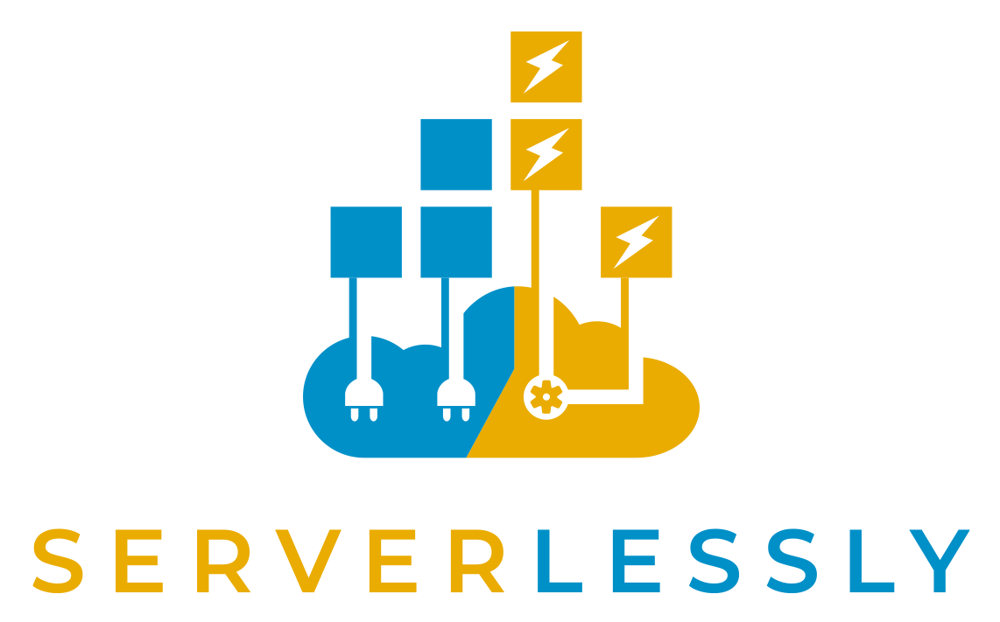

    

Serverlessly allows you to write _vendor-neutral_ cloud-native microservices which you can run on any FaaS (AWS Lambda, Azure Functions etc) as well as in your own infrastructure at scale (Auto-scaling EC2, Kubernetes etc).

---

:warning: **Notice:** Serverlessly is currently in early conception phase with multiple architecture ideas being implemented & tested. No release has been made so far.

---
